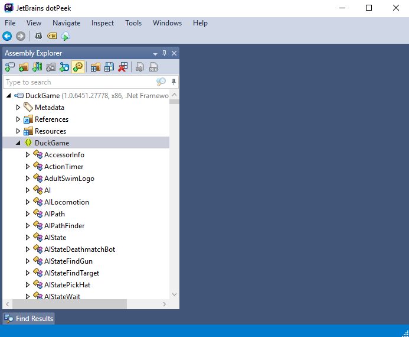
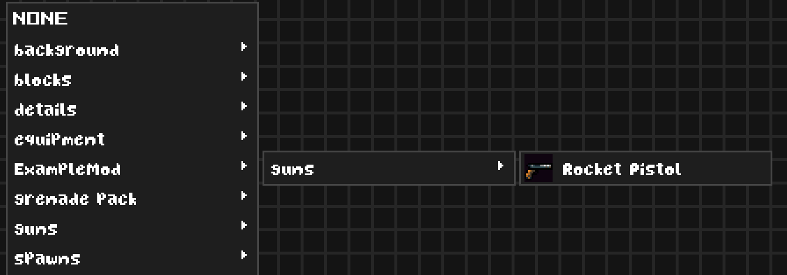
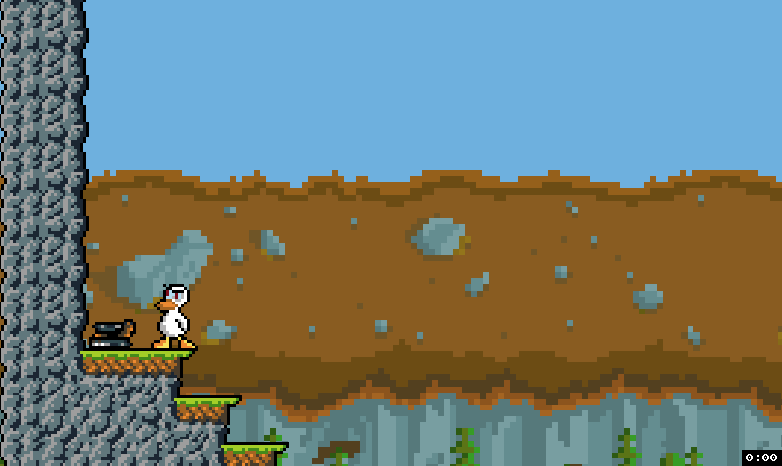
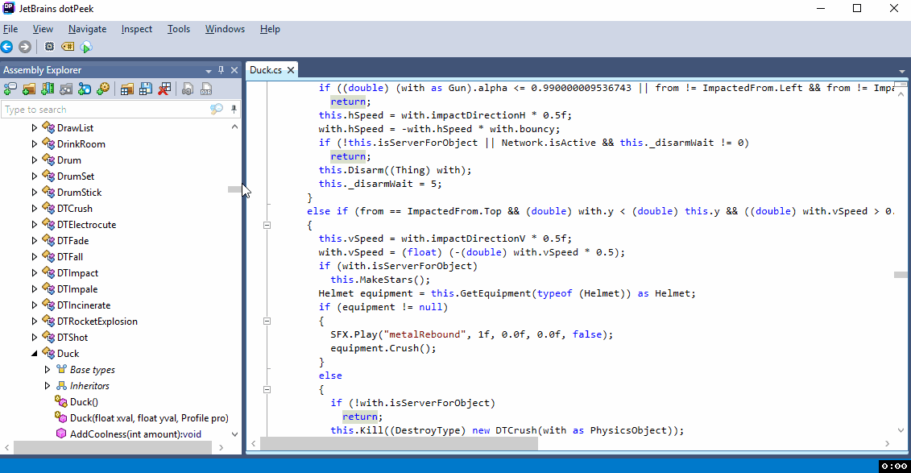
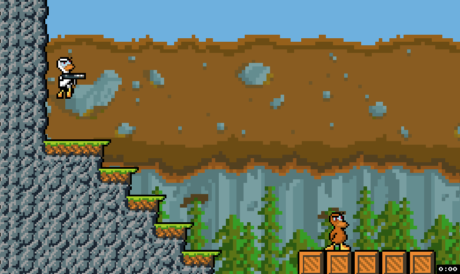
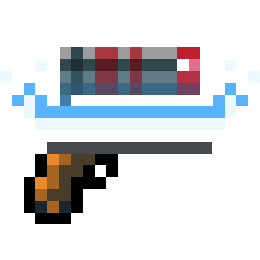
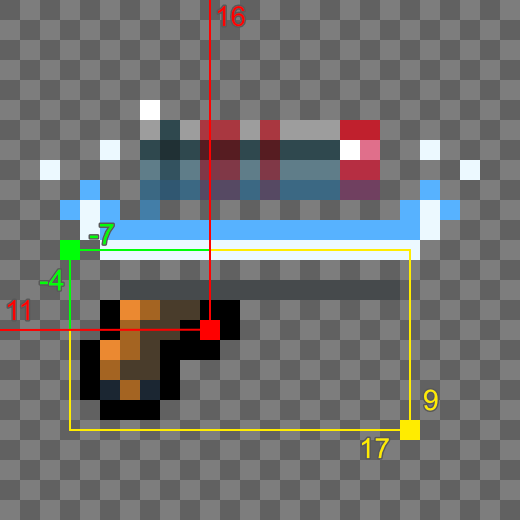
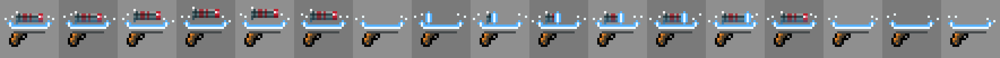
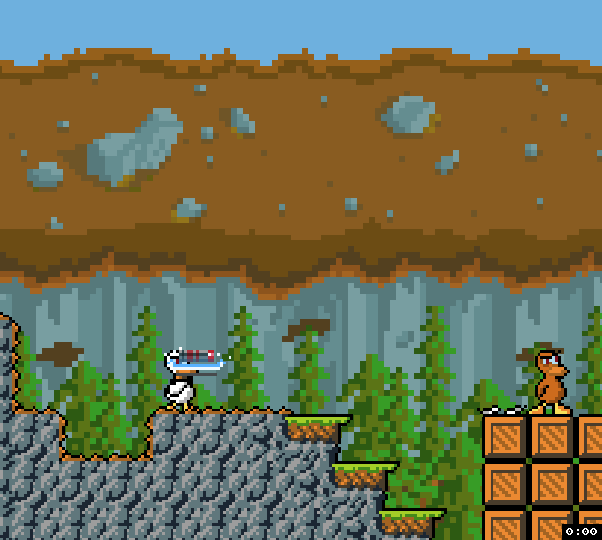

Duck Game Modding
=================

(Original guide from [Michael Palmos's Blog](https://toqoz.fyi/duck-game-mods.html) _20 November, 2018_ +updates)

So you want to make some mods for Duck Game? Look no further. 
This guide should tell you almost everything you need to know about making a good mod that actually functions. 
We'll talk about getting set up, explain some of Duck Game's core mod structure, 
talk about networking, and hopefully most of the other little details you might need.

Is Making Mods Difficult?
-------------------------

Mods for Duck Game can definitely be made with only a basic understanding of programming.
Whether those mods are spaghetti or not might be a different story, 
but making basic mods in Duck Game is relatively easy.

Skills that may help significantly: 
knowledge of basic object oriented programming, 
basic C# knowledge, a bit of intuition in reading other people's code, and most of all, **time**. 
You might have heard elsewhere that writing mods for Duck Game is very fiddly, and that's because it is. 
A lot (most?) of your time will be spent reading through the Duck Game source code 
to try and figure out how the developer has achieved a similar effect to something you're trying to make, 
and then deciphering _why_ exactly it has been done in that way. 
If you don't have much in the way of these skills just yet, making mods can be a great learning experience.

Before Starting
---------------

First of all, please read through [this](https://steamcommunity.com/sharedfiles/filedetails/?id=484818341) 
guide if you haven't already. 
It'll help you set up your environment for writing your first mod and explain some basic variables, 
although I didn't find the latter to be of much use personally.


The Modding Process
-------------------

Let's make a simple "Hello World" mod. 
I'm going to explain the entire process from head to toe, 
which should give you some intuition on how to progress when you want to write some mods for yourself.

First of all, we need a mod idea. 
A simple example that comes to mind is a pistol that shoots missiles.

The first thing we need to do is open up the Duck Game executable in a .NET decompiler 
([ILSpy](https://github.com/icsharpcode/ILSpy#ilspy-----) 
or [dotPeek](https://www.jetbrains.com/decompiler/) work… I'll be using dotPeek). 
This will let us see how the game was coded and give us some hints as to how we should code things.


> Alternatively you can use the [DuckGameRebuilt](https://github.com/TheFlyingFoool/DuckGameRebuilt) project 
> to look into the game's code, which is easier and better organized, 
> but keep in mind there may be some differences with the base game like added functions or properties, 
> anyway the mod project will complain if you try to reference something that is not in the original `DuckGame.exe`.

> You can also check the original code from VisualStudio 
> by using the `Go to definition/implementation` option 
> when right-clicking on any class or method name.

  

Since we're making a pistol, let's navigate to the Pistol class and have a look at what's going on;
```c#
// Pistol.cs
namespace DuckGame
{
    [EditorGroup("guns")]
    [BaggedProperty("isInDemo", true)]
    public class Pistol : Gun
    {
        private SpriteMap _sprite;

        public Pistol(float xval, float yval) : base(xval, yval)
        {
            this.ammo = 9;
            this._ammoType = (AmmoType) new AT9mm();
            this._type = "gun";
            this._sprite = new SpriteMap("pistol", 18, 10, false);
            this._sprite.AddAnimation("idle", 1f, true, new int[1]);
            this._sprite.AddAnimation("fire", 0.8f, false, 1, 2, 2, 3, 3);
            this._sprite.AddAnimation("empty", 1f, true, 2);
            this.graphic = (Sprite) this._sprite;
            this.center = new Vec2(10f, 3f);
            this.collisionOffset = new Vec2(-8f, -3f);
            this.collisionSize = new Vec2(16f, 9f);
            this._barrelOffsetTL = new Vec2(18f, 2f);
            this._fireSound = "pistolFire";
            this._kickForce = 3f;
            this._holdOffset = new Vec2(-1f, 0.0f);
            this.loseAccuracy = 0.1f;
            this.maxAccuracyLost = 0.6f;
            this._bio = "Old faithful, the 9MM pistol.";
            this._editorName = nameof (Pistol);
            this.physicsMaterial = PhysicsMaterial.Metal;
        }

        public override void Update()
        {
            if (this._sprite.currentAnimation == "fire" && this._sprite.finished) {
                this._sprite.SetAnimation("idle");
            }
            base.Update();
        }

        public override void OnPressAction()
        {
            if (this.ammo > 0)
            {
                this._sprite.SetAnimation("fire");
                for (int index = 0; index < 3; ++index)
                {
                    Vec2 vec2 = this.Offset(new Vec2(-9f, 0.0f));
                    Vec2 hitAngle = this.barrelVector.Rotate(Rando.Float(1f), Vec2.Zero);
                    Level.Add((Thing) Spark.New(vec2.x, vec2.y, hitAngle, 0.1f));
                }
            }
            else {
                this._sprite.SetAnimation("empty");
            }
            this.Fire();
        }
    }
}
```

Not so complicated! We just assign some properties in the constructor related to the gun's look and feel, 
and then code the rest of the gun's behaviour by hooking into some functions.

A big thing to recognise here is that Duck Game modding is largely made possible by method overriding. 
I'm sure there's a name for this kind of pattern, 
but basically to make derivatives of a particular class without duplicating a lot of code, 
we inherit that class, override important methods and add some code, and then call the base method at some point. 
This has a kind of cascade effect; in the Pistol class' `Update()` method, 
we call the Gun class' `Update()`, which calls its own `base.Update()`, etc, etc.

This is especially useful in creating objects for games 
because we often have a lot of similar base behaviour, but want to **add** extra things to it. 
You can see this in action through the rest of the Duck Game items: 
Pistol inherits Gun which inherits Holdable which inherits PhysicsObject which inherits ….

With that in mind, we can begin making our rocket pistol;

```c#
// RocketPistol.cs

namespace DuckGame.ExampleMod
{
    // Allow item to appear in the level editor.
    [EditorGroup("ExampleMod|guns")]
    public class RocketPistol() : Pistol
    {
        // xval and yval are passed to the base class.
        public RocketPistol(float xval, float yval) : base(xval, yval)
        {
            this._editorName = "Rocket Pistol";
            // We only need to change the ammo type, everything else is inherited from the base constructor.
            this._ammoType = (AmmoType) new ATMissile();
        }
    }
}
```

As you can see, we only really need to change the ammo type and the base constructor will handle the rest. 
Figuring out how and which ammo type to switch to was relatively straightforward 
because the ammo types are labeled quite clearly – this isn't always the case, 
and you might need to do some digging to find out what to do to get what you want working.

At this point I'd recommend making a custom map using the game's level editor and placing a spawner with your item. 
As per the `EditorGroup` code above, 
it can be found under ExampleMod -> guns -> Rocket Pistol.

  
  


### More Functionality

Lets add something else. 
What if we wanted to make it so that the weapon gets dropped every time we shoot? 
Here's where some intuition comes in, and getting to know the codebase will help. 
Knocking items out of people's hands is a fairly common action in Duck Game, 
so you can bet there's a method in place already for it. 
The most logical place for this method would be on the Duck object – indeed, `Disarm()` exists. 
The next thing we need is a reference to the Duck object so that we can actually call this method. 
A logical place for this might be on the item – indeed, `owner` exists.

Once we've figured out what method we want to use, it's relatively easy to find out how to use it. 
Right click on the method in your decompiler and click "Find Usages". 
This will show you all the usages of the method in the Duck Game source, 
and is your number one guide in figuring out how to use something.  
  

```c#
// RocketPistol.cs

namespace DuckGame.ExampleMod
{
    public class RocketPistol : Pistol
    {
        // xval and yval are passed to the base class.
        public RocketPistol(float xval, float yval) : base(xval, yval)
        {
            this._editorName = "Rocket Pistol";
            // We only need to change the ammo type, everything else is inherited from the base constructor.
            this._ammoType = (AmmoType) new ATMissile();
        }

        public override void OnPressAction()
        {
            // Run the base action.
            base.OnPressAction();
            // It's best practice to double check that we have an owner before accessing it.
            if (this.owner != null) {
                (this.owner as Duck).Disarm((Thing) this);
            }
        }
    }
}
```

  


### Changing Look and Details

Changing the look of your item can be easy or difficult depending on how much you want to change. 
For starters, let's change the weapon sprite to something more fitting. 
Place the sprite you want to use in your mod's content folder 
(`%appdata%/DuckGame/Mods/ExampleMod/content` if you're following along), 
and give it a fitting name. 
I'll be using something I prepared earlier;

  
_(real sprite is much smaller (26x26))_

> Sprites / sounds used can be found here: [laser.wav](./DuckGameModding-imgs/RocketPistolModFiles/laser.wav) and 
[rocketpistol.png](./DuckGameModding-imgs/RocketPistolModFiles/rocketpistol.png) 

```c#
namespace DuckGame.DevelopmentMod
{
    [EditorGroup("ExampleMod|guns")]
    public class RocketPistol : Pistol
    {
        // Property to hold our sprite.
        private SpriteMap _sprite;

        public RocketPistol(float xval, float yval) : base(xval, yval)
        {
            //...

            // Get the sprite from content/rocketpistol.png (extensions not included).
            this._sprite = new SpriteMap(GetPath("rocketpistol"), 26, 26, false);
            this.graphic = (Sprite) this._sprite;
            this.center = new Vec2(11f, 16f);
            this.collisionOffset = new Vec2(-7f, -4f);
            this.collisionSize = new Vec2(17f, 9f);

            // Switch the shot sound with a custom one (located at content/sounds/laser.
            this._fireSound = GetPath("sounds/laser");
        }
        //...
    }
}
```

Most of this should be relatively straightforward by now. 
For reference, to figure out which variables to change 
I simply looked at the pistol class (listed above) 
and applied some common sense and trial / error.

There are a few points here that would benefit from an explanation however, namely the collision information. 
A picture is worth a thousand words, so here's a diagram:

 _**red** – center  
**green** – collision offset  
**yellow** – collision size_

The first point to understand here are first of all that 0, 0 is placed at the top left of the sprite. 
The second point is that the collision offset and collision size are _relative_ values; collision offset is relative to the center point, and collision size is relative to the collision offset.

With that sorted, let's move on to something more fun: **animations**. 
Animations in duck game are mainly delivered in the form of sprite sheets. You're probably familiar with these if you've done any kind of game development before. 
Here's one I made for our rocket pistol:

  
_(real sprite sheet has a transparent background)_

The idea is simple; you make a sprite sheet similar to the above which contains all the frames of your animation, preferably in order. 
You can – and should – store multiple "separate" animations within this file if you need more than one animation for the same object. 
We can then create and assign animations from within the weapon's constructor;

```c#
public RocketPistol(float xval, float yval) : base(xval, yval)
{
    this._editorName = "Rocket Pistol";
    this._ammoType = (AmmoType) new ATMissile();
    this._sprite = new SpriteMap(GetPath("rocketpistol"), 26, 26, false);

    // Create idle animation.
    this._sprite.AddAnimation("idle", .08f, true, 0, 1, 2, 3, 4, 5);
    // Create fire animation (more of a reload animation here really).
    this._sprite.AddAnimation("fire", .15f, false, 6, 7, 8, 9, 10, 11, 12, 13);
    // Create empty animation.
    this._sprite.AddAnimation("empty", .08f, true, 14, 15, 16);

    this.graphic = (Sprite) this._sprite;
    this.center = new Vec2(11f, 16f);
    this.collisionOffset = new Vec2(-7f, -4f);
    this.collisionSize = new Vec2(17f, 9f);
    this._fireSound = GetPath("sounds/laser");

    this._sprite.SetAnimation("idle");
}
```

The `AddAnimation()` function takes 4 parameters: the name of the animation, 
the speed of each frame, whether the animation loops or not, and then the actual animation frames. 
I'm not sure exactly what the speed parameter represents, 
but lower values will make the animation slower, and higher values faster. 
You can also repeat frames if you need part of an animation to last a little longer, 
the default pistol does this with its "fire" animation.  
To play an animation, we simply call `SetAnimation()` with the animation's name.

To get our animations to play at the correct time, 
I've copied some of the code from the base pistol class' `OnPressAction()` function into our own. 
This lets us have a bit more control over when we can set animations and under what circumstance. 
I've also added the smoke you see when you fire the regular rocket launcher, 
removed the pistol sparks, and made some of our logic make a bit more sense:
```c#
public override void OnPressAction()
{
    if (this.ammo > 0) {
        // If gun is going to be empty, don't load a new rocket.
        this._sprite.SetAnimation(this.ammo == 1 ? "empty" : "fire");

        // Smoke, modified from Bazooka.cs
        // This code has probably been lost in translation when decompiling, which is why it's so cryptic.
        int num = 0;
        for (int i = 0; i < 5; ++i) {
            MusketSmoke musketSmoke =
                new MusketSmoke(this.x - 16f + Rando.Float(32f) + this.offDir * 10f, this.y - 16f + Rando.Float(32f));
            musketSmoke.depth = (Depth) ((float) (.9f + (float) i * (1f / 1000f)));
            if (num < 3)
                musketSmoke.move.x -= (float) this.offDir * Rando.Float(0.1f);
            if (num > 3 && num < 5)
                musketSmoke.fly.x += (float) this.offDir * (2f + Rando.Float(7.8f));
            Level.Add((Thing) musketSmoke);
            ++num;
        }

        // It makes more sense to disarm here because it only happens when we actually shoot a rocket.
        if (this.owner != null) {
            (this.owner as Duck).Disarm((Thing) this);
        }
    }

    this.Fire();
}
```

Copying code from the base class into your custom one 
is something you'll find yourself doing often 
in order to have more control over what the item does, 
intricate mods can quickly become very tricky because of this.

  

I now realise that most of the reload animation gets lost in the smoke – but it's a nice detail nonetheless.


Publishing
----------

To upload your mod to the steam workshop, 
I recommend reading the section titled "Uploading and updating" of the 
[official steam guide](https://steamcommunity.com/sharedfiles/filedetails/?id=484818341).


Networking
----------

There's not a lot of information out there on making your mod work online.

The first thing you should know is that Duck Game doesn't use your typical client-server architecture. 
There is a main host that handles level transitions and things like that, 
but each duck / computer effectively acts as its own server for objects that it thinks it owns. 
Examples of these might be items that you've picked up (weapons, boxes, etc), 
or things you've interacted with (doors, mostly). 
The main thing to realise here is that all clients work together 
to send and receive information and synchronise their version of the scene. 
Each duck is responsible for synchronising the things that they own, 
and your mod is responsible for specifying exactly how that happens.

### State Bindings

Variables that have state bindings attached to them will have their values sent from the object owner to the other clients. 
You should use these to keep important variables synchronised across clients.

An example of state bindings being used in the official game is for grenades;
```c#
public class Grenade : Gun
{
    public StateBinding _timerBinding = new StateBinding(nameof (_timer), -1, false, false);
    public StateBinding _pinBinding = new StateBinding(nameof (_pin), -1, false, false);
    public bool _pin = true;
    public float _timer = 1.2f;
    //...

    public override void Update()
    {
        base.Update();
        if (!this._pin)
        this._timer -= 0.01f;

        if (!this._localDidExplode && (double) this._timer < 0.0) {
            this.CreateExplosion(this.position);
        }
        //...
    }
    //...
}
```

> Note that this code has been simplified, the real decompiled code is much more complex.

There are two StateBindings here, 
one for the pin, and one for the timer. 
Synchronising the pin means that each client knows when to start their timer, 
and synchronising the timer means that the grenade should explode at the same time on each client, 
even if someone lags and gets the pin message late. Really, 
the game would probably work fine most of the time with just one of these, 
but both are used to cover a few edge cases and make everything a bit smoother.

It's not necessary to synchronise everything. 
Try to reason about what your mod _needs_ to run properly, 
and what will _help_ it run better. 
This is how almost all efficient networking works. 
If you were making a sticky grenade, 
it probably doesn't make sense to update the grenade's position over each network frame to make it follow a player. 
Instead, you could send the player it was stuck to just once, and update the position locally.

There's a degree of authority involved with state bindings. 
You can't really change a binded variable of an object you don't own; 
if you do, the owner will sooner or later tell you 
what the real value of that variable is and override your changes. 
This doesn't mean that you should rely on network variables; 
good networking runs locally and keeps itself synchronised as often as possible.

On the PC release, state bindings are generally synchronised as soon as possible upon being changed.

### Fondle()

`Fondle()` is used to take to take ownership of an object. 
As we know, this mostly means handing over control of the state bindings. 
When a local Duck picks up or interacts with an object, 
it automatically calls `Fondle()` on the object to make sure it's in control of the object.

```c#
// Door.cs
public override void OnSoftImpact(MaterialThing with, ImpactedFrom from)
{
    if (with.isServerForObject && this.locked && with is Key)
    {
        if (Network.isActive)
        {
            // Take ownership of the door object.
            with.Fondle((Thing) this);
            Send.Message((NetMessage) new NMUnlockDoor(this));
            this.networkUnlockMessage = true;
        }
        this.UnlockDoor(with as Key);
    }
    base.OnSoftImpact(with, from);
}
```

If your mod wants to change the state of some world object (such as a level block), 
you should use `Fondle()` to take ownership beforehand. 
This will keep all clients in sync and thus maintain consistency.

> Aside, broken doors in Duck Game are considered `_fucked`.
```c#
if (!this._fucked && (double) this._hitPoints < (double) this._maxHealth / 2.0)
{
    this._sprite = new SpriteMap(this.secondaryFrame ? "flimsyDoorDamaged" : "doorFucked", 32, 32, false);
    this.graphic = (Sprite) this._sprite;
    this._fucked = true;
}
```

### `Level.Add()` and `isServerForObject`

When you need to add something to a level, be it a feather, box, bullet, or otherwise, 
chances are you'll be using `Level.Add()` in some form or another.

When a client who is the object owner calls `Level.Add()`, 
it adds the object to the level and marks its entirety to be sent to each client. 
When a client who isn't the object owner calls `Level.Add()`, it only adds the object to the level. 
For this reasoning, it is important that you **only** call `Level.Add()` for the object's owner; 
if you don't, chances are two copies will be spawned, 
one local (spawned by you) and one remote (spawned by the owner).

```c#
// From a custom fire grenade mod.
protected override void OnExplode(Vec2 pos)
{
    if (isServerForObject) {
        for (int i = 0; i < _fireExplodeAmount; i++) {
            float speedx = Rando.Float(_fireExplodeSpeed.x, -_fireExplodeSpeed.x);
            float speedy = Rando.Float(-_fireExplodeSpeed.y);
            Level.Add(SmallFire.New(pos.x, pos.y, speedx, speedy,
                false, null, true, this, false));
        }
    }
    SFX.Play(GetPath("sounds" + Path.DirectorySeparatorChar + "incendiary.wav"), 1f, 0f, 0f, false);
}
```

The same goes for playing sounds which should be synchronized, 
but you'll have to use a `NetSoundBinding`, 
which I won't cover here (it's very similar to a `StateBinding`).

```c#
/// Duck.cs
public void Scream()
{
    if (Network.isActive) {
        if (this.isServerForObject) {
            this._netScream.Play(1f, 0.0f);
        }
    }
    //...
}
```
    

Notes / extra thought dump stuff
--------------------------------

Resources that helped me:
 * [Guide: Making your own gun!](https://steamcommunity.com/sharedfiles/filedetails/?id=595956552)  
 * [Modding discussions: [Beta] Mod desynchs in new item](https://steamcommunity.com/app/312530/discussions/3/541906989409705452/)  


### Logging
You can log messages into the game's console, 
the one that pops up when you press the tilde (`) key, 
from your Mod's code by adding this:
```c#
DuckGame.DevConsole.Log(DCSection.Mod, "This message will appear in the game's console");
```

### Spinning
Setting `gravMultiplier` to a value of 0 or less, or `weight` to a value of 5 or more, 
will stop an item from spinning in the air. Only classes inheriting from `Gun` spin.


### Soft impact vs solid impact
Soft impacts happen when an object moves through something 
(throwing a grenade sideways through boxes). 
Solid impacts happen when an object hits something 
that causes it to stop / triggers physics (throwing a grenade against a wall).

